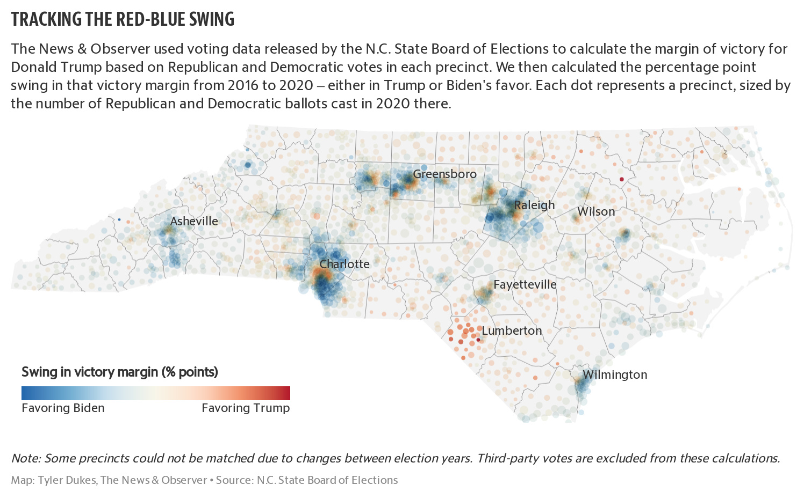
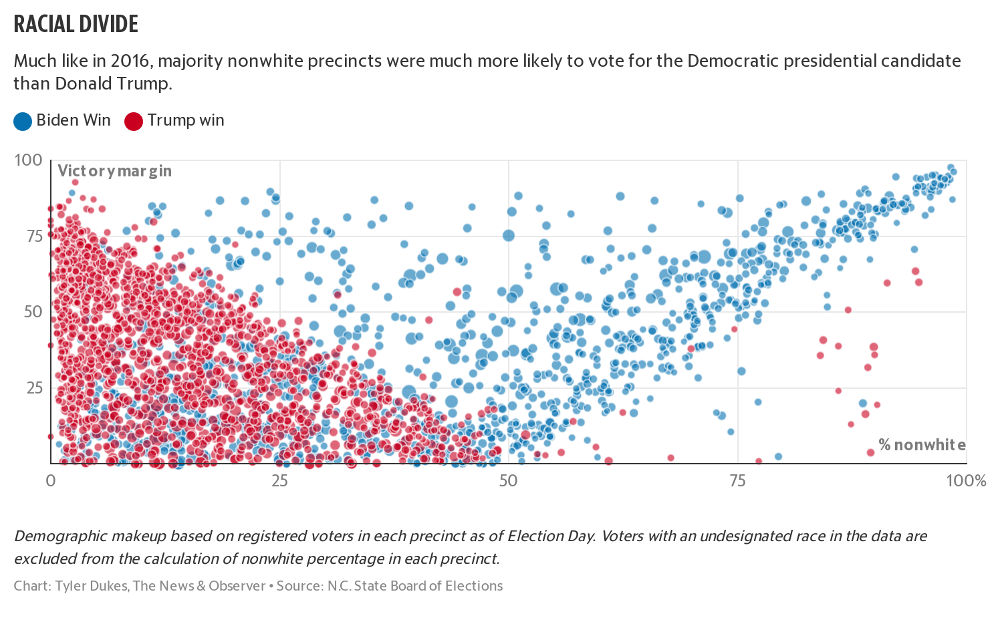

# Preliminary findings
Reporters with The News & Observer analyzed data from the N.C. State Board of Elections detailing precinct-level voting patterns. [Review the readme file for the full methodology.](https://github.com/mtdukes/precinct-analysis-2020)

And for a detailed breakdown of the code used for this analysis, [see our R script here](https://github.com/mtdukes/precinct-analysis-2020/blob/main/data/ps_analysis_clean.R).

## Two-party swing

Because population can change significantly in the four-year cycle of a precinct, we calculated the victory margins between Republican and Democratic presidential candidates in 2016 and 2020 and calculated the difference to produce the **swing in victory margin**. A positive swing in the victory margin benefits Trump, while a negative swing benefits Biden.

This analysis excludes third-party votes.

The magnitude of the swing in victory margin is shown for each precinct in the [map below](https://datawrapper.dwcdn.net/rRBLf/10/) by color, and the size of each dot represents the number of votes cast for each party in 2020.

### Tracking the swing

[See a fullscreen version of this interactive map here.]([https://datawrapper.dwcdn.net/rRBLf/10/](https://datawrapper.dwcdn.net/rRBLf/10/))

Overall, growth in Democratic votes outpaced growth in Republican votes in the presidential elections between 2016 and 2020.

### Change in party votes, 2016 to 2020
Candidate|Votes in 2016|Votes in 2020|Raw change|Percent change
--|--|--|--|--
Donald J. Trump|2,363,065|2,758,845|395,780|16.75
Clinton/Biden|2,189,315|2,684,438|495,123|22.62

## Candidate performance

From 2016 to 2020, only 139 of 2,658 precincts flipped from Biden to Trump or vice versa. But a vast majority of those flips went to Biden – and they accounted for larger net gains for Democrats.

### Flipped precincts, 2016 to 2020
Flip|Precinct count| Raw vote swing
--|--|--
Trump to Biden|115|34,072
Biden to Trump|24|2,108

Biden outperformed Clinton's margin in more than 1,600 precincts across the state in 2020, compared to the 1,000 or so precincts in which Trump outperformed his 2016 showing.

### Where candidates overperformed
Candidate|Precinct count|Raw vote swing
--|--|--
Biden|1,611|291,417
Trump|987|108,167

Compared to the 2016 presidential, Biden earned fewer votes than Clinton in about twice as many precincts as Trump. That translates into a loss of more than twice as many voters.

### Where candidates lost votes
Candidate|Precincts with lost votes|Total votes lost
--|--|--
Trump|143|8,029
Biden|271|18,430

Conversely, Biden improved on Clinton's vote totals in a smaller number of precincts than Trump did. But those precincts translated in a larger number of actual votes.

### Where candidates gained votes
Candidate|Precincts with gained votes|Total votes gained
--|--|--
Trump|2,445|394,314
Biden|2,318|508,069

That leaves 10 precincts that matched vote totals for Trump in 2016/2020 and 9 for Democrats.

## Racial demographics

Compared to 2016, precinct-level data shows Trump picked up a few additional majority-minority districts in 2020, excluding voters who registered "undesignated" as their race.

### Majority-minority precincts won, 2016 to 2020
Candidates|Precincts won in 2016|Precincts won in 2020
--|--|--
Biden/Clinton|505  (96.6%)|511  (95.0%)   
Trump | 18   (3.4%)|27   (5.0%)    
Total|523|538

But like in 2016, Trump won only a single majority Black precinct, excluding voters who registered "undesignated" as their race.

### Majority Black precincts won, 2016 to 2020

Candidates|Precincts won in 2016|Precincts won in 2020
--|--|--
Biden/Clinton|397|394
Trump|1|1
Total|398|395

In 2020, Trump carried all but one majority American Indian/Alaskan Native precinct, excluding voters who registered "undesignated" as their race, three more than in 2016.

### Majority American Indian precincts won, 2016 to 2020
Candidates|Precincts won in 2016|Precincts won in 2020
--|--|--
Biden/Clinton|3|1
Trump|13|16    
Total|16|17

Based on voter registration, plotting the percentage of nonwhite voters in a precinct against margin of victory shows stark racial division in the presidential race in 2020.

### Margin of victory vs. percentage of nonwhite voters by precinct, 2020

[See a fullscreen version of this interactive chart here.]([[https://datawrapper.dwcdn.net/YdLjg/2/](https://datawrapper.dwcdn.net/YdLjg/2/)))

Plotting the distribution of precincts by the swing in victory margin (the difference between the victory margin of Trump in 2020 minus the victory margin of Trump in 2016) shows the number of precincts that swung in each candidates favor skewed toward Biden. The grey line in the chart below shows the average.

## Margin distribution

### Distribution of precincts by swing in victory margin, 2016 to 2020

That's especially apparent when plotting the results side by side.

### Distribution of precincts by swing in victory margin, 2016 to 2020

But the swing in raw votes from party to party (the difference between the change in votes for Trump between 2020 and 2016) is also skewed toward Biden. The grey line in the chart below shows the average.

### Distribution of precincts by swing in net votes, 2016 to 2020

A side-by-side comparison shows that despite the skew toward Biden, Trump was particularly successful increasing his swing in raw votes in precincts on the smaller end of these swings – 150 votes or less.

### Distribution of precincts by swing in net votes, 2016 to 2020
