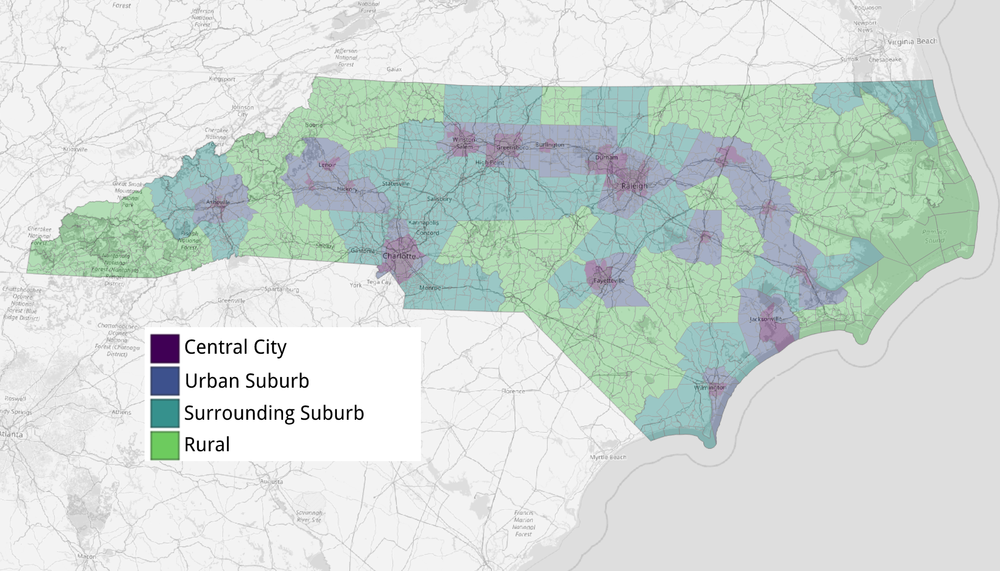

# 2020 precinct sort analysis

Voters who cast their ballots provisionally or via absentee in North Carolina elections aren't placed in their assigned precincts in the initial results. That happens weeks later, when the N.C. State Board of Elections produces county-level precinct sort files.

Precinct sort data gives us fine-grained insight into voting patterns for every contest down to what is essentially the neighborhood level.

Reporters at The News & Observer analyzed precinct sort files from 2016 and 2020 to see how things changed over four years from one general election to the next.

One measure of that change is the swing in victory margin – how many percentage points the margin of victory between Republican and Democratic presidential candidates changed between 2020 and 2016.

For some precincts, these changes are approximate, since not every vote can be mapped precinct to precinct across the two election cycles.

See our detailed methodology for a breakdown of how the N&O did its analysis, the data we used and the caveats for our findings.

## The data

The News & Observer used publicly available data from the N.C. State Board of elections.

**[2016 precinct sort files](https://dl.ncsbe.gov/?prefix=ENRS/2016_11_08/results_precinct_sort/)**  Precinct-level data on votes for each candidate in each contest in the 2016 elections, as of Jan. 20, 2020.

**[2020 precinct sort files](https://dl.ncsbe.gov/?prefix=ENRS/2020_11_03/results_precinct_sort/)**  Precinct-level data on votes for each candidate in each contest in the 2020 elections, as of Jan. 20, 2020.

**[2016 precinct map shapefile](https://s3.amazonaws.com/dl.ncsbe.gov/PrecinctMaps/SBE_PRECINCTS_20161004.zip)**  Map file that contains the geographic data on North Carolina precincts as of October 2016.

**[2020 precinct map shapefile](https://s3.amazonaws.com/dl.ncsbe.gov/PrecinctMaps/SBE_PRECINCTS_20201018.zip)**  Map file that contains the geographic data on North Carolina precincts as of October 2020.

**[2016 voter registration snapshot](https://s3.amazonaws.com/dl.ncsbe.gov/data/Snapshots/VR_Snapshot_20161108.zip)**  The database of registered North Carolina voters as of Election Day 2016.

**[2020 voter registration snapshot](https://www.whitehouse.gov/wp-content/uploads/2020/03/Bulletin-20-01.pdf)**  The database of registered North Carolina voters as of Election Day 2020.

**[OMB memo on MSA designations](https://www.whitehouse.gov/wp-content/uploads/2020/03/Bulletin-20-01.pdf)**  Memo from the federal Office of Management and Budget, dated March 6, 2020, showing revised definitions of metropolitan statistical areas. Used to create precinct-level rural-urban designations.

## Precincts and votes not included

The N&O used [code written in R](https://github.com/mtdukes/precinct-analysis-2020/blob/main/data/ps_analysis_clean.R) to first match the precinct sort data to the corresponding precinct mapping file for 2016 and 2020. We then matched the precincts across the two election cycles for comparison.

But comparing precincts across election years isn’t perfect.

Although mostly static, precinct boundaries do sometimes change, and counties at times split up or combine precincts between election cycles.

There are also some absentee and provisional votes that can’t be added back to specific precincts, largely due to human error, says SBE spokesperson Pat Gannon.

“Specifically, the errors of poll workers at one-stop early voting sites, who did not note the voter’s precinct of residence on the ballots prior to issuing the ballots to the voters,” Gannon said in an email to the N&O. “That makes it impossible to sort back into the precinct.”

Across both the 2016 and 2020 presidential elections, our analysis failed to match about 297,000 out of the nearly 10 million votes cast. That means our comparisons are missing about 3% of the vote. Here’s how that breaks down:

Error category | 2016 | 2020
--|--|--
Votes not sorted into precincts|11,922|10,046
Votes in precincts that don’t match other election year|128,964|145,819
Total|140,886|155,865

The matched results are largely proportionally similar to the overall results.

### Comparing matched precincts

Candidate|Votes in 2016|Votes in 2020|Raw change|Percent change
--|--|--|--|--
Donald J. Trump|2,302,330|2,688,615|386,285|16.78
Clinton/Biden|2,109,164|2,598,803|489,639|23.21

Both views of the data show a net shift of about 100,000 votes to Democrats in the presidential race.

## Swing in victory margin

To calculate how much the victory margin in each precinct swung toward Trump or Biden from 2016 to 2020, the N&O used precinct sort data matched between the two election years.

For this analysis, we excluded third party votes, calculating the margin of victory, in percentage points, as:

    (“Votes for GOP candidate” - “Votes for Dem. candidate”)  / “Total votes for GOP and Dem. candidates”

Although the order is arbitrary, we chose to have a positive value indicate a margin of victory in Trump’s favor, since he’s the incumbent. A negative value indicates a margin of victory in Biden/Clinton’s favor (depending on the election year).

After calculating this margin of victory for both 2020 and 2016, we calculated the swing for each precinct, in percentage points, as:

    “2020 margin of victory” - “2016 margin of victory”

So if Trump defeated Clinton 55%-45% in 2016 (a 10-point victory margin), then defeated Biden 57%-43% in 2020 (a 15-point victory margin), the swing in victory margin is +5 percentage points, or 5 points in Trump’s direction.

## Split-ticket voting

There were several statewide races up for grabs in in 2020. But for our analysis of “split-ticket” precincts, we focused on those where candidates from opposite parties won both the presidential and governor’s races.

We focused only on Republican and Democratic candidates for president (Donald Trump and Joe Biden) and governor (Dan Forest and Roy Cooper) and excluded any races where the precinct votes were tied.

That left 129 precincts out of 2,658 that voted for both Donald Trump and Roy Cooper.

No precinct won by Joe Biden also went for Donald Trump. And likewise, no precinct that went for Dan Forest went for Joe Biden.

## Classifying urban/rural precincts

No single established method exists for defining urban and rural precincts, so we employed a methodology used by [Catawba College political science professor Michael Bitzer](http://www.oldnorthstatepolitics.com/p/blog-page_5.html) based on the federal Office of Management and Budget’s designations of “metropolitan statistical areas.”

Using [the agency’s most recent memo on MSAs](https://www.whitehouse.gov/wp-content/uploads/2020/03/Bulletin-20-01.pdf), the N&O created a dataset of these areas, along with their outer and central counties, as defined by OMB. These designations can help split up precincts into four categories radiating out from the urban core:

**Central city** Precincts inside a metropolitan statistical area’s center city that are also located in that MSA’s central county

**Urban suburb** Precincts outside a metropolitan statistical area’s center city, but located inside that MSA’s primary/central county.

**Surrounding suburb** Precincts inside one of the metropolitan statistical area’s counties, but not the primary/central county.

**Rural** Precincts in counties not included in any metropolitan statistical area.

Some precincts span multiple municipalities, or even cross into unincorporated communities. So we used the voter registration snapshots to identify the municipality with the largest share of voters in each precinct. For example, if a Wake County precinct shows 95% of its voters cast ballots in Morrisville municipal races, with the remaining 5% casting ballots for Raleigh municipal races, it counts as a Morrisville precinct.

Using these rules, we designate each precinct with a region type.

## Precincts and race

To calculate the racial demographics of voters in each precinct, the N&O used voter registration snapshots provided by the N.C. State Board of Elections as of [Nov. 3, 2020](https://s3.amazonaws.com/dl.ncsbe.gov/data/Snapshots/VR_Snapshot_20201103.zip), and [Nov. 8, 2016](https://s3.amazonaws.com/dl.ncsbe.gov/data/Snapshots/VR_Snapshot_20161108.zip). We excluded all voters in the database with a status of “denied” or “removed.”

We also excluded all voters whose race is unknown, or “undesignated” in the database, from our calculations of racial makeup.

Nonwhite percentage for each precinct was calculated as the total of “Black or African American,” “other,” “Asian,” “Indian American or Alaskan native,” “two or more races” and “native Hawaiian orPacific islander” divided by the total number of registered voters in the precinct, minus undesignated voters.

Similarly, majority Black and Native American/Alaskan native precincts were identified by calculating the percentage of each racial category out of the total number of registered voters in the precinct, minus undesignated voters.

## Stability and competitiveness

To identify precincts that flipped from one party to the other in the 2016 and 2020 presidential races, the N&O used the victory margin calculations to identify any neighborhood where the vote went from negative (in Biden’s favor) to positive (in Trump’s favor) or vice versa.

As for competitiveness, one common definition for a competitive district is a precinct with margins between 45% and 55% for the two major parties, the equivalent of a margin of victory of 10 points or less for either Republican or Democrat candidates.

The N&O’s analysis used this definition of competitiveness between Republican and Democrats, excluding all third-party candidates, to identify competitive precincts.