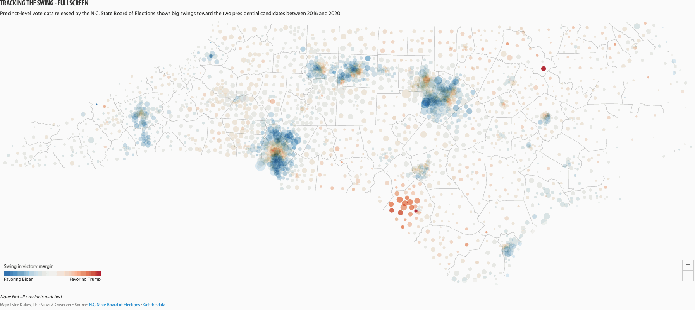
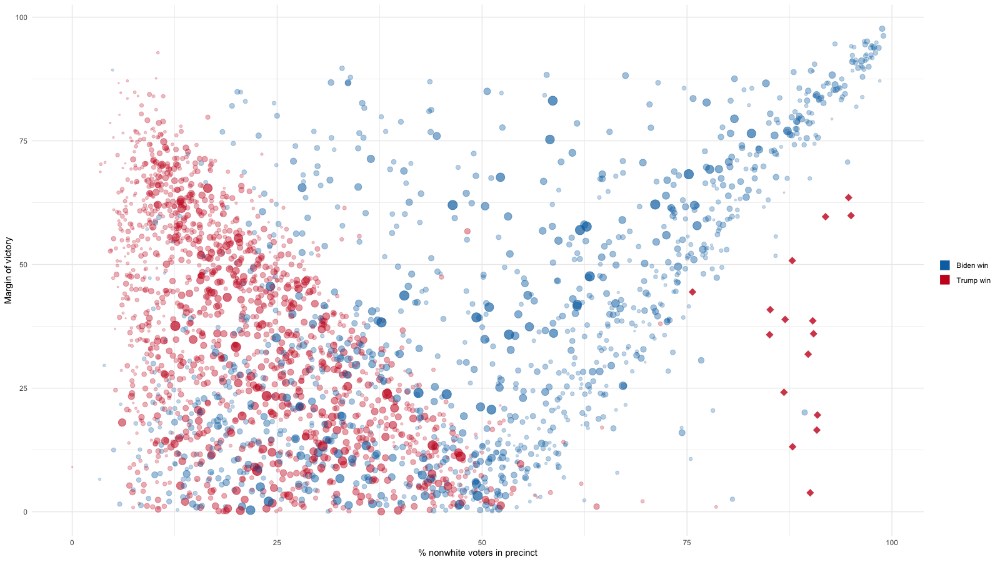
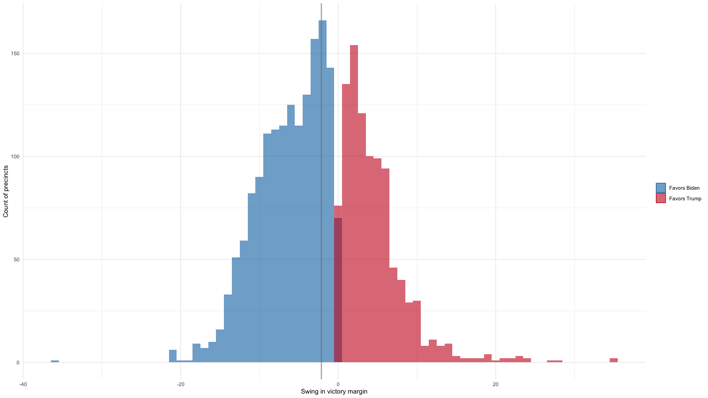
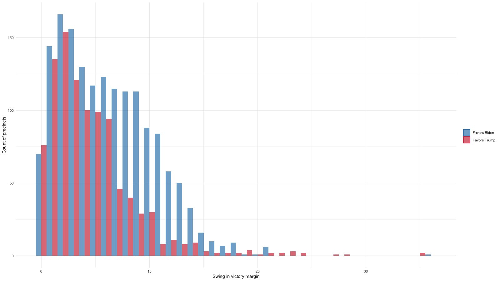
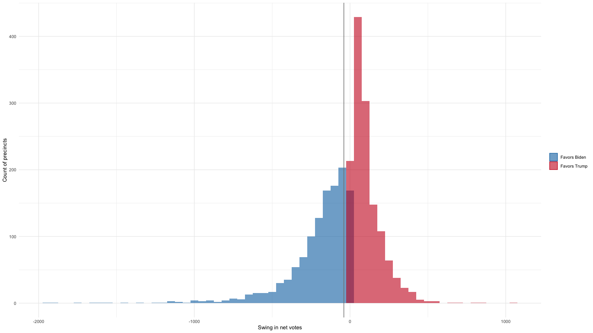
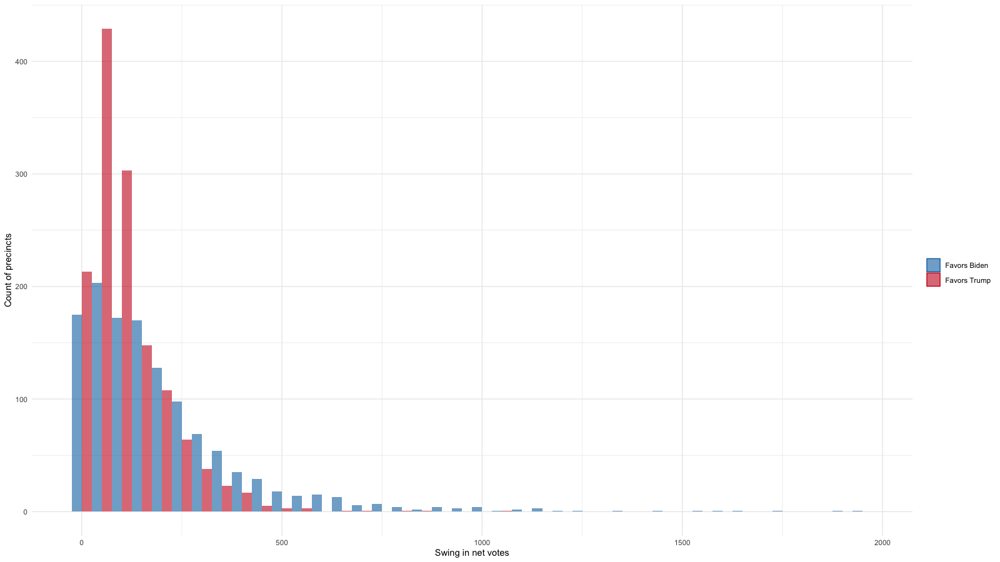

# 2020 precinct sort analysis

Voters who cast their ballots provisionally or via absentee in North Carolina elections aren't placed in their assigned precincts in the initial results. That happens weeks later, when the N.C. State Board of Elections produces county-level precinct sort files.

Precinct sort data gives us fine-grained insight into voting patterns for every contest down to what is essentially the neighborhood level.

Reporters at The News & Observer analyzed precinct sort files from 2016 and 2020 to see how things changed over four years from one general election to the next.

**_PLEASE NOTE: These findings are preliminary and still subject to review and change._**

## Preliminary top-level findings

**_PLEASE NOTE: These findings are preliminary and still subject to review and change._**

Because population can change significantly in the four-year cycle of a precinct, we calculated the victory margins between presidential candidates in 2016 and 2020 and calculated the difference to produce the **swing in victory margin**. A positive swing in the victory margin benefits Trump, while a negative swing benefits Biden.

The magnitude of the swing in victory margin is shown for each precinct in the [map below](https://datawrapper.dwcdn.net/2ZqwZ/1/) by color, and the size of each dot represents the size of the swing in raw votes between the parties from 2016 to 2020.

### Tracking the swing

[See a fullscreen version of this interactive map here.](https://datawrapper.dwcdn.net/2ZqwZ/1/)

**_PLEASE NOTE: These findings are preliminary and still subject to review and change._**

Overall, growth in Democratic votes outpaced growth in Republican votes in the presidential elections between 2016 and 2020.

### Change in party votes, 2016 to 2020
Candidate|Votes in 2016|Votes in 2020|Raw change|Percent change
--|--|--|--|--
Donald J. Trump|2,363,065|2,758,845|395,780|16.75
Clinton/Biden|2,189,315|2,684,438|495,123|22.62

From 2016 to 2020, only 139 of 2,658 precincts flipped from Biden to Trump or vice versa. But a vast majority of those flips went to Biden – and they accounted for larger net gains for Democrats.

### Flipped precincts, 2016 to 2020
Flip|Precinct count| Raw vote swing
--|--|--
Trump to Biden|115|34,072
Biden to Trump|24|2,108

Biden outperformed Clinton's margin in more than 1,600 precincts across the state in 2020, compared to the 1,000 or so precincts in which Trump outperformed his 2016 showing.

### Where candidates overperformed
Candidate|Precinct count|Raw vote swing
--|--|--
Biden|1,611|291,417
Trump|987|108,167

Compared to the 2016 presidential, Biden earned fewer votes than Clinton in about twice as many precincts as Trump. That translates into a loss of more than twice as many voters.

### Where candidates lost votes
Candidate|Precincts with lost votes|Total votes lost
--|--|--
Trump|143|8,029
Biden|271|18,430

Conversely, Biden improved on Clinton's vote totals in a smaller number of precincts than Trump did. But those precincts translated in a larger number of actual votes.

### Where candidates gained votes
Candidate|Precincts with gained votes|Total votes gained
--|--|--
Trump|2,445|394,314
Biden|2,318|508,069

That leaves 10 precincts that matched vote totals for Trump in 2016/2020 and 9 for Democrats.

Compared to 2016, precinct-level data shows Trump picked up just over a dozen additional majority-minority districts in 2020.

### Majority-minority precincts won, 2016 to 2020
Candidates|Precincts won in 2016|Precincts won in 2020
--|--|--
Biden/Clinton|538  (96.1%)|600  (93.6%)   
Trump | 22   (3.9%)|41   (6.4%)    
Total|560|641

But like in 2016, Trump failed to win a single majority Black precinct.

### Majority Black precincts won, 2016 to 2020

Candidates|Precincts won in 2016|Precincts won in 2020
--|--|--
Biden/Clinton|379|314
Trump|0|0
Total|379|314

In 2020, Trump carried all majority American Indian/Alaskan Native precincts, three more than in 2016.

### Majority American Indian precincts won, 2016 to 2020
Candidates|Precincts won in 2016|Precincts won in 2020
--|--|--
Biden/Clinton|3|0
Trump|13|16    
Total|16|16

**_PLEASE NOTE: These findings are preliminary and still subject to review and change._**

Based on voter registration, plotting the percentage of nonwhite voters in a precinct against margin of victory shows stark racial division in the presidential race in 2020. Each dot presents a precinct, sized by the total number of registered voters and shaded based on the size of the 2020 victory margin for each candidate.

The diamonds represent majority American Indian/Alaskan Native precincts.

### Margin of victory vs. percentage of nonwhite voters by precinct, 2020

Plotting the distribution of precincts by the swing in victory margin (the difference between the victory margin of Trump in 2020 minus the victory margin of Trump in 2016) shows the number of precincts that swung in each candidates favor skewed toward Biden. The grey line in the chart below shows the average.

### Distribution of precincts by swing in victory margin, 2016 to 2020

That's especially apparent when plotting the results side by side.

### Distribution of precincts by swing in victory margin, 2016 to 2020

But the swing in raw votes from party to party (the difference between the change in votes for Trump between 2020 and 2016) is also skewed toward Biden. The grey line in the chart below shows the average.

### Distribution of precincts by swing in net votes, 2016 to 2020

A side-by-side comparison shows that despite the skew toward Biden, Trump was particularly successful increasing his swing in raw votes in precincts on the smaller end of these swings – 150 votes or less.

### Distribution of precincts by swing in net votes, 2016 to 2020

**_PLEASE NOTE: These findings are preliminary and still subject to review and change._**

## The data

**_PLEASE NOTE: These findings are preliminary and still subject to review and change._**

The News & Observer used the following publicly available data from the N.C. State Board of elections

- [2016 precinct sort files](https://dl.ncsbe.gov/?prefix=ENRS/2016_11_08/results_precinct_sort/)
- [2020 precinct sort files](https://dl.ncsbe.gov/?prefix=ENRS/2020_11_03/results_precinct_sort/)
- [October 2016 precinct map shapefile](https://s3.amazonaws.com/dl.ncsbe.gov/PrecinctMaps/SBE_PRECINCTS_20161004.zip)
- [October 2020 precinct map shapefile](https://s3.amazonaws.com/dl.ncsbe.gov/PrecinctMaps/SBE_PRECINCTS_20201018.zip)
- [Nov. 3, 2020, voter registration snapshot](https://s3.amazonaws.com/dl.ncsbe.gov/data/Snapshots/VR_Snapshot_20201103.zip)
- [Nov. 8, 2016, voter registration snapshot](https://s3.amazonaws.com/dl.ncsbe.gov/data/Snapshots/VR_Snapshot_20161108.zip)
- 
**_PLEASE NOTE: These findings are preliminary and still subject to review and change._**

## Methodology

**_PLEASE NOTE: These findings are preliminary and still subject to review and change._**

For a detailed breakdown of the code used for this analysis, [see our R script here](https://github.com/mtdukes/precinct-analysis-2020/blob/main/ps_analysis_clean.R).

Because of precinct changes and leftover votes in administrative districts, matching 2016 and 2020 precinct data isn't always perfect. But the matched results are largely similar to the overall results.

### Comparing matched precincts

Candidate|Votes in 2016|Votes in 2020|Raw change|Percent change
--|--|--|--|--
Donald J. Trump|2,302,330|2,688,615|386,285|16.78
Clinton/Biden|2,109,164|2,598,803|489,639|23.21

Both views of the data show a net shift of about 100,000 votes to Democrats in the presidential race.

**_PLEASE NOTE: These findings are preliminary and still subject to review and change._**